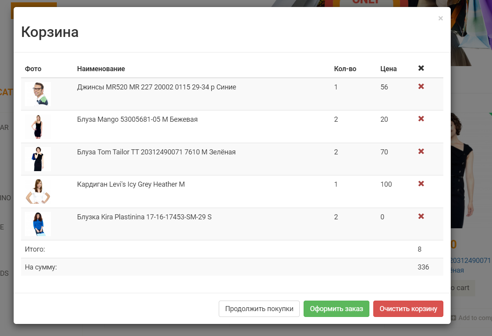
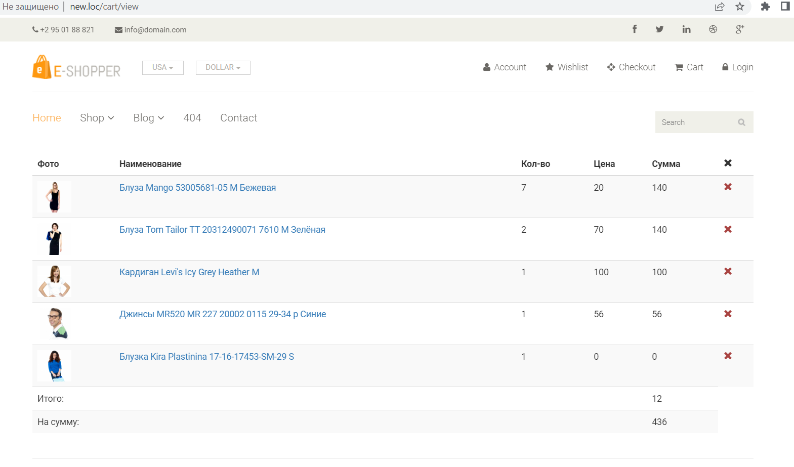
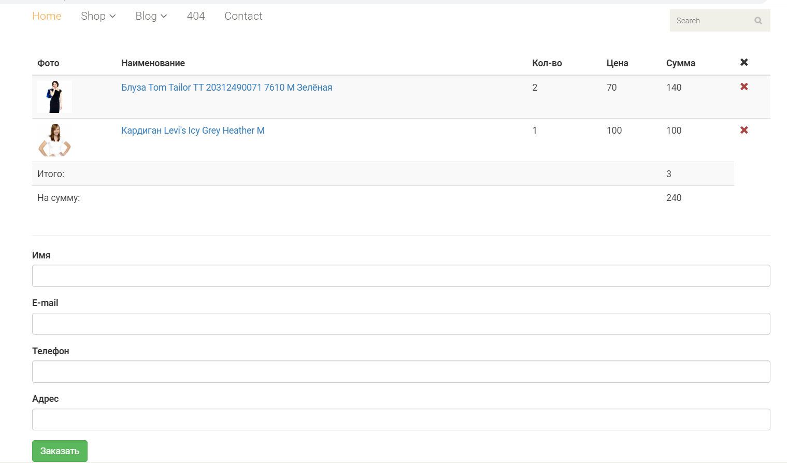
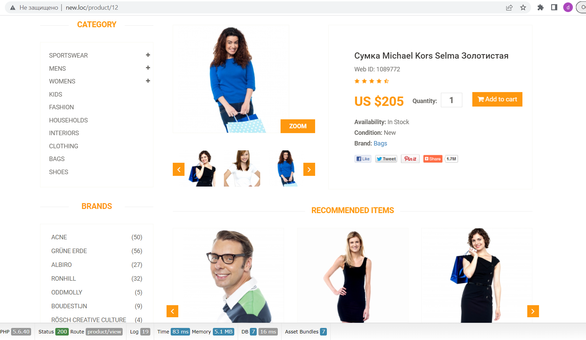

## Online Shop: my study project

I use:

* PHP 7.4
* Yii v2.0.7
* MySQL 5.5
* Apache 2.4

-----------
BSD-3-Clause license
-----------
------------
* I found a free online store layout template and added my own ideas to it. Now I am writing the backend part of the project. 
* I use Phantom.js (headless web browser) to make some screenshots of my site!
Here they are:

