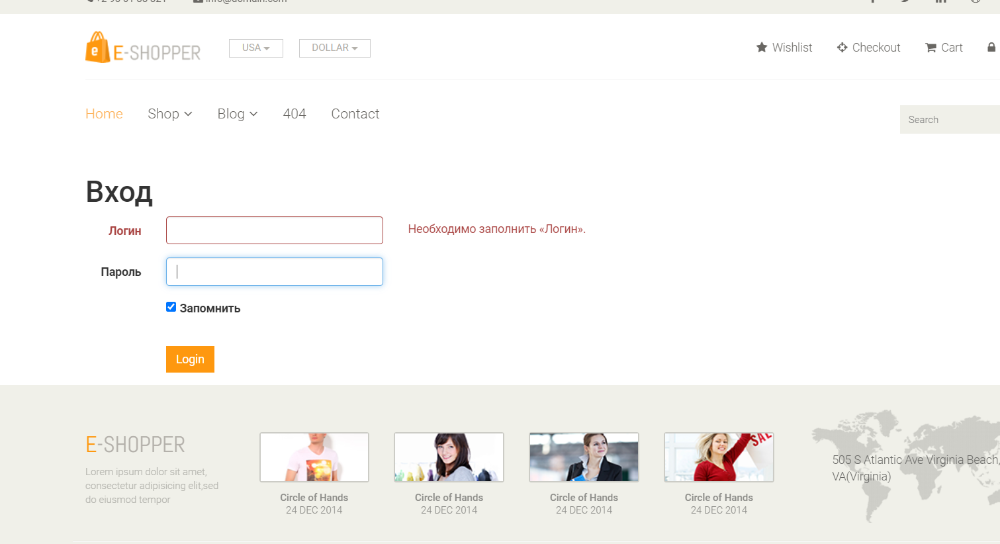

## Online Shop: my study project

I use:

* PHP 5.6
* Yii v2.0.7
* MySQL 5.5
* Apache 2.4

-----------
BSD-3-Clause license
-----------
------------
## How to get it:
First of all, you need to install php 5.6, mySQL server, Apache web server (or OpenServer, Xamp)
1) Run: git clone https://github.com/DariaUtkinaEj/eshop
2) Insert a secret key (cookie validation key) in ./config/web.php
3) Run: composer install
4) Setup web-server settings, domain: /web/index.php
-------------------
* I found a free online store layout template and added my own ideas to it. Now I am writing the backend part of the project. 
* I use Phantom.js (headless web browser) to make some screenshots of my site!
Here they are:

